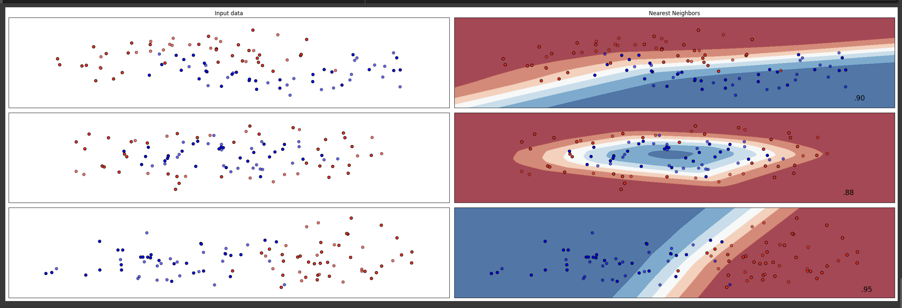

# all-projects-summary
This repository contains a comprehensive summary and detailed explanations of all my projects. It serves as an overview of my work, showcasing key features.

# Project 1: Sign Language Giphy Website 

## Description
The SignLanguage Giphy Website is an innovative project at providing an accessible platform for Deaf or Hard of Hearing (DHH) individuals. This project leverages the power of Elastic Search to create a searchable database of sign language GIFs, making it easier for users to find and share relevant content. 

## Technology Used
- React
- ElasticSearch
- Python
- Node.js
- Express
- CSS 

## Features
- Search Functionality: Utilize ElasticSearch to provide fast and accurate search results for sign language GIFs. 
- Category Filtering: Useres can filter GIFs by various categories such as emotions, events, and holidays.
- Tag-based Search: Search for GIFs using tags for more precise results.
- Responsive Design: The website is designed to be fully responsive and accessible on all devices.
- User Authentication: Secure login and registration functionality.
- Pagination: Efficiently handle large volumes of GIFs with paginated results.
- Interactive UI: Hover effects and dropdown menus enhance user experience. 


## Screenshots:


## Website Demo:
Demo of website: [[Website Demo] ](https://drive.google.com/file/d/1Lzn71-iUj5Kq8zdeNmznV_M5TIYZsN1Z/view)


# Project 2: Machine Learning LLM Chatbot

## Description
The Machine Learning LLM Chatbot project combines the development of a chatbot using Microsoft PHI with research on the differences between attention mechanisms and transformers, as well as the optimization of a Multi-Layer Perceptron (MLP). This comprehensive project aims to enhance the chatbot's performance and accuracy through various machine learning techniques and detailed research.

## Technology Used
- Microsoft PHI
- Python
- TensorFlow
- PyTorch
- Scikit-Learn

## Features
- Chatbot Development: Built using Microsoft PHI to provide interactive and accurate responses.
- Attention and Transformer Research: Detailed study on attention mechanisms and transformers to understand their differences and applications.
- MLP Optimization: Extensive optimization of MLP parameters to achieve better performance.

## Research and Development
### Attention and Transformer Research
The research on attention mechanisms and transformers includes:
- Deep Learning and NLP Overview: Introduction to deep learning, its history, and its applications in natural language processing (NLP).
- Attention Mechanisms: Explanation of different types of attention mechanisms such as Bahdanau attention, self-attention, scaled dot-product attention, and multi-head attention.
- Transformer Model: Detailed analysis of the transformer model, its components (encoder and decoder stacks), and its advantages over traditional models.
- Applications and Benefits: Application of attention mechanisms in NLP and other fields, highlighting the improvements in performance and scalability.

### MLP Optimization
The optimization process for the MLP involved:
- Initial Setup: Starting with basic parameters such as `alpha = 1`, `max_iter = 1000`, and `random_state = 42`.
- Optimization Phases**: 
  - Phase 1: Modification of parameters including `alpha`, `max_iter`, `hidden_layer_sizes`, `learning_rate`, `solver`, and `momentum`.
  - Phase 2: Implementation of grid search to test various parameter values and record data in a CSV file for analysis.
- Final Results: Achieved optimization values of 0.95, 0.90, and 0.95 with specific parameters for `n_samples = 100`.

## Screenshots
### MLP Optimization


## Links 
Presentation of Attention and Transformer Review: [Presentation Link](https://drive.google.com/file/d/1xhSTINCoy0kTzd9V0Zzr3kUu4SxIJpQa/view?usp=sharing)


## Conclusion
This project showcases the integration of chatbot development with advanced research in attention mechanisms and transformer models, along with significant improvements in MLP optimization. The findings and implementations from this project can be applied to enhance various NLP applications and machine learning models.


## Project 3: Interactive Image Selection 

## Description
This project is part of the CS 2110: Object-Oriented Programming and Data Structures course at Cornell University. It focuses on developing an enhanced graphical application for interactive image selection using Java Swing. The primary goal is to implement the "intelligent scissors" algorithm, allowing for more precise selection of subjects in images with curved edges by finding the shortest paths in graphs.

### Background
The Selector application allows users to open an image file, draw a selection around a region of the image, and save their selection as a new file. Initially, users can draw a polygonal selection by clicking points to form vertices, but this project enhances that functionality with an intelligent tracing tool that automatically follows edges in the image. This project builds on the foundation laid in Assignment 5 of the course.

## Technology Used
- Java
- Swing
- AWT

## Features
- Priority Queue: Implemented using a heap and paired with a Dictionary for efficient priority changes.
- Dijkstra's Algorithm: Utilized to find shortest paths in a weighted graph.
- Polymorphic Behavior: Multiple subclasses of a parent type to provide varied behvaiors. 
- SwingWorker: Extended to perform expensive computations concurrently with an interactive GUI.
- Pixel Calculations: Performed calculations on neighborhoods of pixels in a color image.
- Custom Weights: Experimented with custom weights in the "intelligent scissors" algorithm to follow edges more accurately. 

## Learning Objectives
- Implement a Priority Queue using a heap and pair it with a Dictionary.
- Implement Dijkstra’s algorithm for shortest paths in a weighted graph.
- Provide polymorphic behavior with multiple subclasses.
- Extend SwingWorker for concurrent computation.
- Perform calculations on neighborhoods of pixels in a color image.
- Experiment with custom weights in the “intelligent scissors” algorithm.

## Files Description
- PolyLineBuffer.java: Manages a buffer of polyline points for rendering the selected area. 
- ScissorsSelectionModel.java: Implements the intelligent scissors algorithm for image selection.
- ScissorsWeights.java: Defines different weight calculation methods for the intelligent scissors algorithm.
- ImageGraph.java: Represents the image as a graph where each pixel is a vertex connected to its neighbors.
- ImagePathsSnapshot.java: Captures the current state of pathfinding progress for visualization.

## Screenshots


# Project 4: Functors Find Common Ground

## Description
Functors Find Common Ground is a command-line utility designed to identify and display the common lines between two text files. The utility prints the intersecting lines in sorted order without duplication, providing support for both case-sensitive and case-insensitive comparisons.

## Technology Used
- OCaml
- Dune

## Features
- Identify and display common lines between two text files.
- Supports both case-sensitive and case-insensitive comparisons.
- Outputs intersecting lines in sorted order without duplicates.
- Interactive mode for experimenting with utility functions.

## Building the Project:
Download the zip file and place it in a safe location.
Go to the place where your downloaded folder is placed. 
cd .. 
To build the project, execute the following command in terminal: dune build

## Running Tests:
To run the test cases that are written in the tests_a4.ml file, use the following command in terminal: dune test
This will run all the test cases and report any failures, ensuring the utility functions as expected.
In this case, the dune test will run 10 tests. 

## Interactive Mode: 
To experiment with utility functions interactively, run: dune utop
This opens the OCaml REPl where you can manually invoke functions. 
Refer to .mli files for function signatures and expected parameters.

## Basic Command: 
For case-sensitive comparison, execute: dune exec bin/main.exe <filename1> <filename2>
In my case, I have two files called a.txt and b.txt.
So in this case, it would be dune exec bin/main.exe a.txt b.txt
For case-insensitive comparison, execute: dune exec bin/main.exe – -i <filename1> <filename2>
Again, it would be dune exec bin/main.exe – -i a.txt b.txt

  
## Checking Coverage: 
In order to check coverage, follow three commands. 
-name ‘*.coverage’ | xargs rm -f
dune test –instrument-with bisect_ppx --force 
This will run the test and give you the test result
bisect-ppx-report html

Then in the finder, you can see the file and see the coverage of the test. 
### Terminal


### Coverage Repot


# Project 5: Wordle Game

## Description
The Wordle Game project involves creating a digital version of the popular word-guessing game. This project showcases skills in game development, user interface design, and interactive gameplay mechanics. The project is divided into two main modules: the frontend (`main.ml`) and the backend (`wordle.ml`).

## Technology Used
- OCaml

## Implemented Features
- **Interactive Gameplay**: Engages users with a dynamic and responsive word-guessing game.
- **Word Dictionary Management**: Utilizes a comprehensive word list to validate guesses and ensure game accuracy.
- **User Interface**: Features a clean, intuitive interface with real-time feedback and updates.
- **Guess Tracking**: Keeps track of user guesses and displays the results after each attempt.
- **Color-coded Feedback**: Provides visual cues using color-coding to indicate correct, misplaced, and incorrect letters.
- **Game Logic**: Implements robust game logic to handle different scenarios, including win and lose conditions.
- **Cheat Mode**: Allows users to play in a regular mode or a cheat mode where the target word is displayed.

## Files Description
- **main.ml**: This file serves as the frontend, directly interacting with the player, handling user input, and displaying the output of the game.
- **wordle.ml**: This file serves as the backend, encapsulating the logic of the game, managing the word dictionary, and implementing the core game mechanics.


## Example Usage
### Starting the Game
- Open the terminal and run the compiled game. The game interface will prompt you to choose a game mode: 
  - Enter `1` for Regular mode.
  - Enter `2` for Cheat mode.

### Making a Guess
- Type a five-letter word and press "Enter" to submit your guess.

### Receiving Feedback
- The game will provide color-coded feedback for each letter in your guess:
  - **Green**: Correct letter in the correct position.
  - **Yellow**: Correct letter in the wrong position.
  - **Gray**: Incorrect letter.

### Continuing the Game
- Continue making guesses based on the feedback until you either guess the correct word or run out of attempts.

### Winning or Losing
- **Winning**: Successfully guess the correct word within the allowed attempts.
- **Losing**: Fail to guess the correct word within the allowed attempts. The correct word will be revealed.

## Example Screenshots
- **User Interface**:
  
- **Game Won**:
  
- **Game Lost**:
  
- **Test Case**:
  
  
  
### Conclusion
The Wordle Game project demonstrates the ability to create an engaging and interactive game using OCaml. This project highlights skills in user interface design, game logic implementation, and real-time interactivity.


# Project 6: Garden Simulation Project


## Description
The Garden Simulation Project is a utility designed to visually simulate a garden ecosystem, including various plant types and animals. Users can observe interactions within the garden through discrete time steps, visualizing growth, spread, and animal movements. The simulation allows customization of grid size and speed, supporting both case-sensitive and case-insensitive modes for species identification.

## Technology Used
- OCaml
- Dune

## Features
- Visual Simulation: Observe a dynamic garden ecosystem with plant growth and animal movements.
- Customizable Grid: Users can set the grid size and simulation speed.
- Case-Sensitive/Insensitive Modes: Supports flexible species identification.
- Interactive Mode: Experiment with utility functions in the OCaml REPL.

## Building the Project
1. **Download and Extract**: Download the project zip file and extract it to a preferred location.
2. **Navigate to Directory**: Open a terminal and navigate to the project’s root folder:
    ```sh
    cd /path/to/your/folder
    ```
3. **Compile the Project**: Execute the following command:
    ```sh
    dune build
    ```

## Garden Simulation User Manual
 [[User Manual] ](https://drive.google.com/file/d/1mlOd7HXFwdOkAj4Re4gTsF7jM3To6S4K/view?usp=sharing)

## Garden Simulaiton Design Documentation
 [[Design Documentation] ](https://drive.google.com/file/d/1NVJh1bEAN9Ss-znNuyg2IZVrfTxca3mM/view?usp=sharing)
 

  
  
  # Project 7: RPN Evaluator

### Description
The RPN (Reverse Polish Notation) Calculator is a command-line utility that evaluates mathematical expressions written in reverse Polish notation. This project was developed to demonstrate proficiency in stack-based algorithms and command-line interface design. 

### Technology Used
- Java

### Features
- Stack-based Calculation: Utilizes a stack data structure to evaluate RPN expressions efficiently.
- Basic Operations: Supports basic arithmetic operations such as addition, subtraction, multiplication, and division. 
- Extended Operations: Includes support for more complex operations such as exponentiation and square roots.
- Error Handling: Provides informative error messages for invalid expressions and division by zero. 
- Interactive Mode: Users can enter expressions interactively in the command-line interface.

### Files Description. 
- Application.java: Entry point of the application that initializes and runs the RPN calculator.
- Constant.java: Defines constants used throughout the application.
- CSVEvaluator.java: Handles the evaluation of expressions provided in CSV format. 
- Expression.java: Represents mathematical expressions and provides methods to evaluate them. 
- IncompleteRpnException.java: Custom exception class for handling incomplete RPN expressions. 
- MapVarTable.java: Manages variable mappings used in expressions. 
- Operation.java: Enum defining the operations supported by the calculator.
- Operator.java: Implements various mathematical operations. 
- RpnCalc.java: Core class that performs the RPN calculation using a stack.
- RpnParser.java: Parses and converts infix expressions to RPN.
- Token.java: Represents individual tokens in the RPN expression. 
- UnaryFunciton.java: Defines unary functions supported by the calculator.
- UnboundVariableException.java: Custom exception for handling unbound variables.
- UndefinedFunctionException.java: Custom exception for handling undefined functions.
- Variable.java: Represents a variable in an expression.
- VarTable.java: Interface for variable table implementations.


### Example Usage
Below are some examples demonstrating how to use the RPN Calculator in the command-line interface:

1. **Basic Arithmetic Operations**:
    - **Addition**: To evaluate the expression `3 + 4`, input the RPN equivalent `3 4 +`.
        ```sh
        > 3 4 +
        7.0
        ```
    - **Subtraction**: To evaluate the expression `10 - 2`, input the RPN equivalent `10 2 -`.
        ```sh
        > 10 2 -
        8.0
        ```
    - **Multiplication**: To evaluate the expression `6 * 3`, input the RPN equivalent `6 3 *`.
        ```sh
        > 6 3 *
        18.0
        ```
    - **Division**: To evaluate the expression `8 / 4`, input the RPN equivalent `8 4 /`.
        ```sh
        > 8 4 /
        2.0
        ```

2. **Complex Expressions**:
    - **Mixed Operations**: To evaluate the expression `(3 + 4) * 2 / 7`, input the RPN equivalent `3 4 + 2 * 7 /`.
        ```sh
        > 3 4 + 2 * 7 /
        2.0
        ```
    - **Exponentiation**: To evaluate the expression `2 ^ 3`, input the RPN equivalent `2 3 ^`.
        ```sh
        > 2 3 ^
        8.0
        ```

3. **Using Variables**:
    - **Setting Variables**: To set a variable `x` to `5`, use the `set` command.
        ```sh
        > set x 5
        Variable x set to 5.0
        ```
    - **Using Variables in Expressions**: To evaluate the expression `x + 3`, first set `x` and then input the RPN equivalent `x 3 +`.
        ```sh
        > set x 5
        > x 3 +
        8.0
        ```

4. **Functions**:
    - **Defining Functions**: To define a function `square(x) = x * x`, use the `def` command.
        ```sh
        > def square x x 2 ^
        Function square(x) defined.
        ```
    - **Using Functions**: To evaluate `square(4)`, input the function name and its argument in RPN.
        ```sh
        > 4 square()
        16.0
        ```

### Conclusion
The RPN Calculator project demonstrates the implementation of a stack-based algorithm to evaluate reverse Polish notation expressions. The project highlights the importance of error handling and provides an interactive command-line interface for user input.

## Project 8: Linked List CSV Join

### Description
The Linked List CSV Join project involves creating a utility to merge CSV files using a linked list data structure. This project demonstrates the ability to manipulate linked lists and handle CSV file operations, showcasing the integration of data structures with file processing.

### Technology Used
- Java

### Implemented Features
- **Linked List Manipulation**: Utilizes linked lists to store and process CSV data, showcasing efficient data structure operations.
- **CSV Parsing and Writing**: Efficiently reads from and writes to CSV files, ensuring data integrity and proper formatting.
- **Join Operations**: Supports various join operations such as inner join, left join, and right join, providing flexibility in data merging.
- **Error Handling**: Provides informative error messages for invalid file formats and join conditions, enhancing user experience.
- **Interactive Mode**: Allows users to specify join conditions and files interactively, improving usability and adaptability.

### Files Description
- **CsvJoin.java**: Main program file that includes functions to read, process, and write CSV files using linked lists.
- **LinkedList.java**: Implements a generic linked list data structure.
- **Node.java**: Represents a node in the linked list.
- **CsvParser.java**: Parses CSV files and converts them into linked lists.
- **CsvWriter.java**: Writes linked list data back into CSV format.
- **JoinOperations.java**: Implements various join operations on linked lists.
    
### Example Usage
Below are some examples demonstrating how to use the Linked List CSV Join utility in the command-line interface:

1. **Example CSV Files**:
    - **Input File 1 (input1.csv)**:
        ```csv
        id,name,age
        1,Alice,30
        2,Bob,25
        3,Charlie,35
        ```

    - **Input File 2 (input2.csv)**:
        ```csv
        id,department,salary
        1,HR,50000
        2,Engineering,70000
        4,Marketing,45000
        ```

    - **Expected Output File (output.csv)**:
        ```csv
        id,name,age,department,salary
        1,Alice,30,HR,50000
        2,Bob,25,Engineering,70000
        ```

2. **Basic Join Operation**:
    - **Inner Join**: To perform an inner join on two CSV files `input1.csv` and `input2.csv` on the column `id`, use the following command:
        ```sh
        > java CsvJoin input1.csv input2.csv id inner
        ```
      This will produce an output similar to `output.csv` shown above.

3. **Different Join Types**:
    - **Left Join**: To perform a left join, specify `left` as the join type:
        ```sh
        > java CsvJoin input1.csv input2.csv id left
        ```
      This will include all records from `input1.csv` and matching records from `input2.csv`.

    - **Right Join**: To perform a right join, specify `right` as the join type:
        ```sh
        > java CsvJoin input1.csv input2.csv id right
        ```
      This will include all records from `input2.csv` and matching records from `input1.csv`.

4. **Handling Errors**:
    - **Invalid File Format**: If a file is not in CSV format, an error message will be displayed:
        ```sh
        > java CsvJoin invalid_file.txt input2.csv id inner
        Error: invalid_file.txt is not a valid CSV file.
        ```

5. **Interactive Mode**:
    - **Prompting for Input**: Run the application without arguments to enter interactive mode, where you will be prompted to enter file names, join columns, and join types:
        ```sh
        > java CsvJoin
        Enter the first CSV file name: input1.csv
        Enter the second CSV file name: input2.csv
        Enter the column to join on: id
        Enter the type of join (inner, left, right): inner
        ```

### Conclusion
The Linked List CSV Join project demonstrates the use of linked lists to perform join operations on CSV files. This project integrates data structure manipulation with file processing, providing a practical application of linked lists in real-world scenarios.

# Project 9: Course Management System

## Description
The Course Management System (CMS) project is a streamlined solution for managing courses, students, and faculty. This system facilitates course creation, student enrollment, and faculty assignment, ensuring efficient educational management. It includes checks for course capacity and prevents enrollment if a course is full.

## Technology Used
- Java
- MySQL
- Spring Boot
- Thymeleaf

## Implemented Features
- **Course Management**: Allows administrators to create, update, and delete courses. Each course can have a title, description, and schedule. The system checks course capacity and prevents further enrollment if the course is full.
- **Student Management**: Provides functionalities for managing student records including personal details, enrollments, and grades. Administrators can enroll students in courses and update their information as needed. The system checks for scheduling conflicts and credit limits before enrolling students.
- **Faculty Management**: Facilitates the management of faculty records and the assignment of instructors to courses. Faculty members can be added, updated, and assigned to teach specific courses.
- **User Authentication**: Ensures secure login and registration processes for students, faculty, and administrators, protecting sensitive information and restricting access to authorized users.
- **Responsive Design**: The system is designed to be user-friendly and fully functional on both desktop and mobile devices, ensuring accessibility and convenience for all users.
- **Reporting**: Generates comprehensive reports on student performance, course enrollments, and faculty assignments, helping administrators make informed decisions and track progress effectively.

## Example Usage
### Managing Courses
- **Create**: Navigate to "Courses" and click "Add New Course." Fill in the course details including title, description, and schedule, then save.
- **Update**: Select a course from the list, edit the necessary details such as the course description or schedule, and save the changes.
- **Delete**: Select a course and click "Delete" to remove it from the system. The system will check for any students currently enrolled and handle their records accordingly.

### Managing Students
- **Add**: Navigate to "Students" and click "Add New Student." Enter the student's personal details and save.
- **Enroll**: Select a student from the list and assign them to courses. The system checks for scheduling conflicts and credit limits before confirming enrollment. If the course is full, the enrollment will be denied.
- **Update Records**: Edit student information such as contact details or course enrollments, and save the updated records.

### Managing Faculty
- **Add**: Navigate to "Faculty" and click "Add New Faculty." Enter the faculty member's details and save.
- **Assign Courses**: Select a faculty member from the list and assign them to courses they will be teaching. Save the assignments to update the records.

## Conclusion
The Course Management System project demonstrates proficiency in developing an integrated application using Java and Spring Boot, focusing on database management, user interface design, and system integration. This project showcases the ability to handle complex data relationships and provide a seamless user experience for managing educational institutions.
